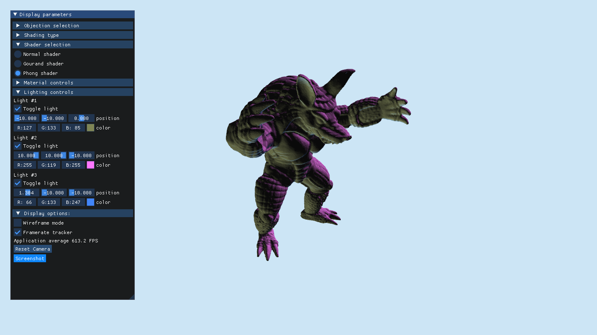
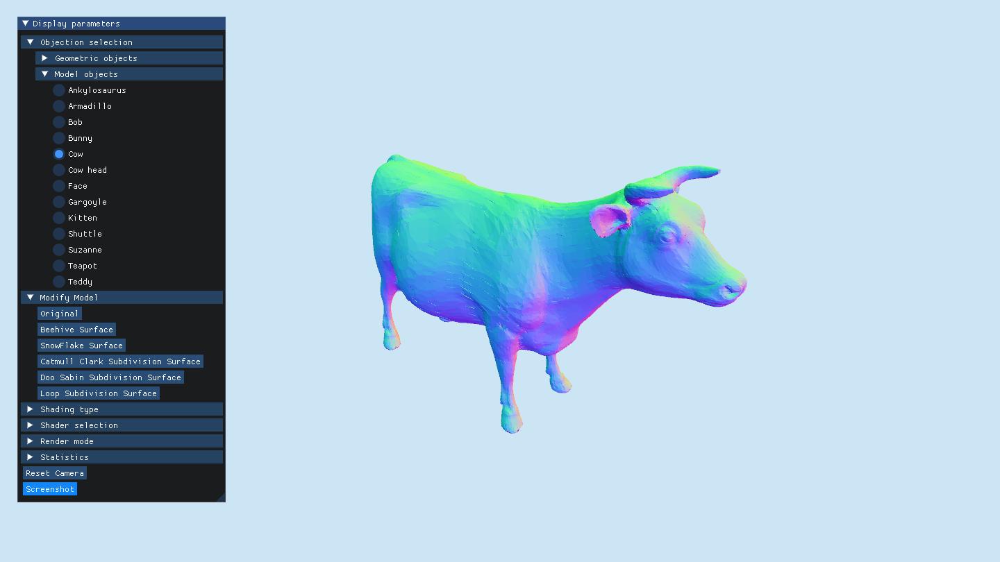
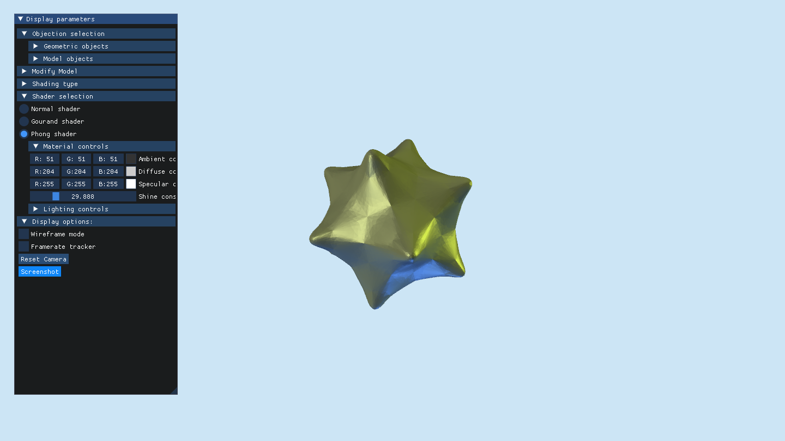

# Model-Modifier

This repository contains my `C++17` and `OpenGL` implementation of a mesh viewer for `.obj` files, with various algorithms for interacting with the meshes, and various shading techniques.

## Features

- [x] Objects
  - [x] Custom .obj parser
  - [x] Triangulation
    - [x] Minimum cost polygon triangulation
- [x] Dynamic object selection
  - [x] Simple geometric objects
  - [x] Complex test objects
  - [x] Automatic rescaling
  - [x] Caching
- [x] Mesh modification algorithms
  - [x] Subdivision surface
    - [x] [Catmull-Clark](https://en.wikipedia.org/wiki/Catmull%E2%80%93Clark_subdivision_surface)
    - [x] [Doo-Sabin](https://en.wikipedia.org/wiki/Doo%E2%80%93Sabin_subdivision_surface)
    - [x] [Loop](https://en.wikipedia.org/wiki/Loop_subdivision_surface)
  - [ ] Simplification surface
    - [ ] [QEM](https://www.cs.cmu.edu/~./garland/Papers/quadrics.pdf)
- [x] Shading options
  - [x] Flat shading (Per-face normals)
  - [x] Smooth shading (Per-vertex normals)
  - [x] Mixed shading (Per-Corner normals)
- [x] Shader options
  - [x] [Normal](<https://en.wikipedia.org/wiki/Normal_(geometry)>) shading
  - [x] [Gourand shading](https://en.wikipedia.org/wiki/Gouraud_shading)
  - [x] [Phong shading](https://en.wikipedia.org/wiki/Phong_shading)
  - [x] [Blinn-Phong shading](https://en.wikipedia.org/wiki/Blinn%E2%80%93Phong_reflection_model)
  - [x] [Gooch shading](https://en.wikipedia.org/wiki/Gooch_shading)
  - [x] [Cel shading](https://en.wikipedia.org/wiki/Cel_shading)
  - [x] [Cook-Torrance shading](https://inst.eecs.berkeley.edu/~cs283/sp13/lectures/cookpaper.pdf)
- [x] Material controls
  - [x] Ambient
  - [x] Diffuse
  - [x] Specular
  - [x] Shine
- [x] Lighting controls
  - [x] Position
  - [x] Color
  - [x] Multiple lights
- [x] Render modes
  - [x] Mesh polygons
  - [x] Wireframe
  - [x] Point cloud
- [x] Interactivity
  - [x] Rotate model
  - [x] Move camera
  - [x] Rotate camera
- [x] Information
  - [x] Framerate counter
  - [x] Number of polygons in current mesh
- [x] Screenshot to PNG

## Image Gallery

> Armadillo mesh, Phong shader, 3 lights from different positions, not smoothened

Comparison of different subdivision surface algorithms

  

> Cow mesh, Normal shader, not smoothened

> Cow mesh, Normal shader, smoothened 1 time with Catmull-Clark subdivision

> Cow mesh, Normal shader, smoothened 1 time with Doo-Sabin subdivision

> Cow mesh, Normal shader, smoothened 1 time with Loop subdivision

> Star mesh, Phong shader, 3 lights from different positions, smoothened many times with mixed subdivision

## Dependencies

- `GLFW`
- `GLM`
- `Dear ImGui`

## List of 3D Models Used

Here I try to list all sources wherever possible.

### Geometric models

| Model Name   | Source                                                                                     |
| ------------ | ------------------------------------------------------------------------------------------ |
| Crumpled     | [Keenan Crane](https://www.cs.cmu.edu/~kmcrane/Projects/ModelRepository/)                  |
| Cube         | Me                                                                                         |
| Double Torus | [Geometry Collective](https://github.com/GeometryCollective/ddg-exercises/tree/main/input) |
| Fandisk      | CAD part Pratt & Whitney/Hughes Hoppe                                                      |
| Icosahedron  | [John Burkardt](https://people.sc.fsu.edu/~jburkardt/data/obj/obj.html)                    |
| Octahedron   | [John Burkardt](https://people.sc.fsu.edu/~jburkardt/data/obj/obj.html)                    |
| Oloid        | [Keenan Crane](https://www.cs.cmu.edu/~kmcrane/Projects/ModelRepository/)                  |
| Sphere       | [Geometry Collective](https://github.com/GeometryCollective/ddg-exercises/tree/main/input) |
| Star         | Unknown                                                                                    |
| T-shape      | Me                                                                                         |
| Torus        | [Geometry Collective](https://github.com/GeometryCollective/ddg-exercises/tree/main/input) |
| Tubes        | Me                                                                                         |

### Test models

| Model Name   | Source                                                                                                 |
| ------------ | ------------------------------------------------------------------------------------------------------ |
| Ankylosaurus | Unknown                                                                                                |
| Armadillo    | [Stanford](http://graphics.stanford.edu/data/3Dscanrep/)                                               |
| Bob          | [Keenan Crane](https://www.cs.cmu.edu/~kmcrane/Projects/ModelRepository/)                              |
| Bunny        | [Stanford](http://graphics.stanford.edu/data/3Dscanrep/)                                               |
| Cow          | [Viewpoint Animation Engineering / Sun Microsystems](https://gfx.cs.princeton.edu/proj/sugcon/models/) |
| Cow head     | [Geometry Collective](https://github.com/GeometryCollective/ddg-exercises/tree/main/input)             |
| Face         | [Geometry Collective](https://github.com/GeometryCollective/ddg-exercises/tree/main/input)             |
| Gargoyle     | [Geometry Collective](https://github.com/GeometryCollective/ddg-exercises/tree/main/input)             |
| Kitten       | [Geometry Collective](https://github.com/GeometryCollective/ddg-exercises/tree/main/input)             |
| Shuttle      | [John Burkardt](https://people.sc.fsu.edu/~jburkardt/data/obj/obj.html)                                |
| Suzanne      | [Blender](https://www.blender.org/)                                                                    |
| Teapot       | [Martin Newell](https://users.cs.utah.edu/~dejohnso/models/teapot.html)                                |
| Teddy        | Unknown                                                                                                |
